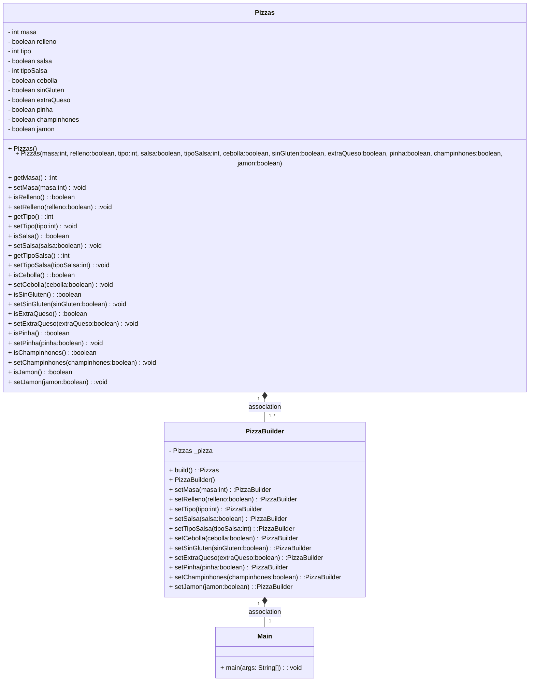
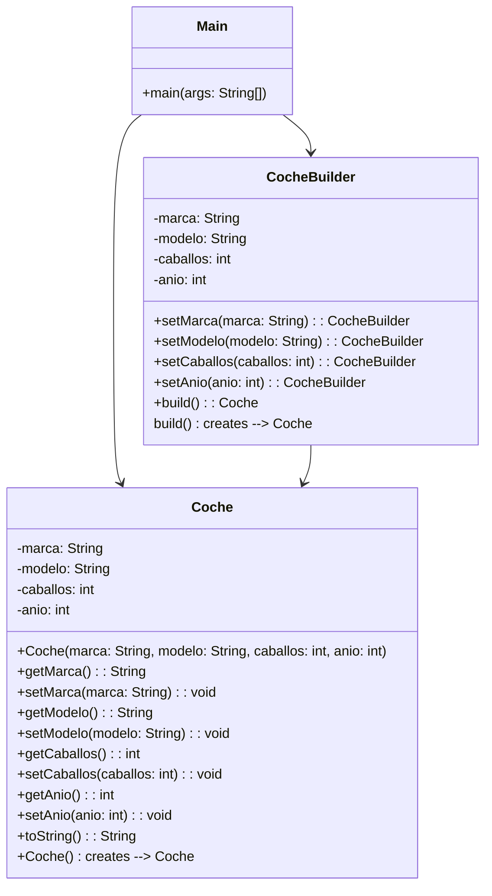

# Patron builder

### diagrama de clases
Correspondiente a la rama builder.



### Función del patrón Builder
Este patrón simplifica la realización de objetos complejos, hace que el código sea más sencillo.
De esta forma conseguiremos que se pueda modificar de una manera más sencilla, y poder crear nuevos objetos de una forma más simple.


### Combinación Builder - Factory

Sí es posible llevar a cabo la combinación, ya que con Builder se pueden crear los objetos y con Factory encapsular la creación.

### Examen

#### Función del patrón builder en el caso de coches
Este patrón nos ayuda a la hora de desarrollar el código, ya que se puede construir de forma más sencilla los objetos, en este caso coche1  y coche2, con diferentes 
valores, además sería fácil añadirle nuevos atributos, mediante CocheBuilder.


##### Diagrama de clases



#### Combinación Builder - Factory (Coches)

Sí se pueden combinar ya que haciéndolo se pueden crear los objetos de forma más flexible, en este caso tendremos que tener en cuenta el uso de la interfaz.

Ejemplo:

```java
public interface CocheFactory {
    Coche crearCoche();
}

public class CocheDeportivoFactory implements CocheFactory {
    private CocheBuilder cocheBuilder = new CocheBuilder()
            .setMarca("Ferrari")
            .setModelo("458 Italia")
            .setCaballos(562)
            .setAnio(2015);

    @Override
    public Coche crearCoche() {
        return cocheBuilder.build();
    }
}

public class CocheFamiliarFactory implements CocheFactory {
    private CocheBuilder cocheBuilder = new CocheBuilder()
            .setMarca("Volkswagen")
            .setModelo("Passat")
            .setCaballos(190)
            .setAnio(2022);

    @Override
    public Coche crearCoche() {
        return cocheBuilder.build();
    }
}

public class Main {
    public static void main(String[] args) {
        CocheFactory cocheDeportivoFactory = new CocheDeportivoFactory();
        Coche cocheDeportivo = cocheDeportivoFactory.crearCoche();
        System.out.println("Coche deportivo creado: " + cocheDeportivo.toString());

        CocheFactory cocheFamiliarFactory = new CocheFamiliarFactory();
        Coche cocheFamiliar = cocheFamiliarFactory.crearCoche();
        System.out.println("Coche familiar creado: " + cocheFamiliar.toString());
    }
}
```


