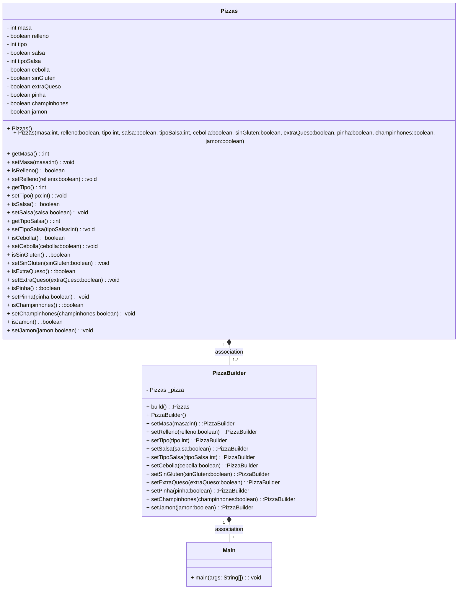

# Patron builder

### diagrama de clases
Correspondiente a la rama builder.

### Función del patrón Builder
Este patrón simplifica la realización de objetos complejos, hace que el código sea más sencillo.
De esta forma conseguiremos que se pueda modificar de una manera más sencilla, y poder crear nuevos objetos de una forma más simple.

### Combinación Builder - Factory

Sí es posible llevar a cabo la combinación, ya que con Builder se pueden crear los objetos y con Factory encapsular la creación.

### Examen